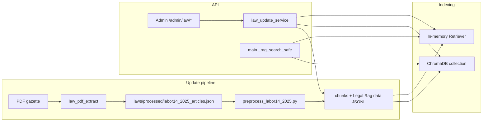

# New Legal RAG: What It Does and How It Works

This document describes the **end-to-end labor-law RAG** added around the Egyptian Labor Law (Law 14 of 2025) corpus: how text becomes searchable vectors, how the API uses them, and how operators can refresh the index from a PDF or canonical JSON.

---

## 1. Goals (what the “new RAG” is for)

- **Ground answers** in the official labor law text (articles), not only model weights.
- **Keep the corpus updatable**: upload a new gazette PDF, or replace `labor14_2025_articles.json`, then **re-chunk**, **re-embed**, and **reload** retrievers without a full redeploy (within the limits below).
- **Two retrieval layers** for resilience:
  1. **Primary**: ChromaDB + dense embeddings (preferred when the Legal RAG stack initializes).
  2. **Fallback**: In-memory retriever over `chunks/*.jsonl` (hashing vectors, or sentence-transformers + FAISS when those libraries load) if Chroma is unavailable or you force the JSONL-only path.

Chat, clause checks, and other flows call a single internal helper (`_rag_search_safe` in `app/main.py`). By default it **prefers Chroma**, then falls back to the in-memory retriever. Set **`LEGAL_RAG_QUERY_BACKEND=memory_only`** to answer from the **in-memory retriever only** (same chunk JSONL produced by preprocess, including after PDF upload). With **`chroma_first`** (default), behavior is unchanged.

---

## 2. High-level architecture

When `LEGAL_RAG_QUERY_BACKEND=memory_only`, runtime search uses **MEM** only (Chroma is not queried for law RAG in `_rag_search_safe`).

---

## 3. Data flow (step by step)

### 3.1 Canonical articles (`labor14_2025_articles.json`)

- **Path**: `laws/processed/labor14_2025_articles.json`
- **Shape**: A JSON array of objects with at least `article`, `text`, and metadata fields suitable for downstream chunking (see extractor below).
- This file is the **source of truth** for text before chunking.

### 3.2 PDF → articles (optional entry point)

- **Module**: `app/law_pdf_extract.py`
- **Method**: PyMuPDF reads the PDF; text is normalized (NFKC, digit mapping); articles are split using a regex that looks for Arabic markers such as `المادة` / `مادة` followed by an article number.
- **Caveat**: Extraction quality depends on **how the PDF encodes text**. Scanned PDFs without a text layer will not work without OCR. Layout quirks may break article boundaries.

### 3.3 Preprocess → JSONL chunks

- **Script**: `scripts/preprocess_labor14_2025.py`
- **Input**: `laws/processed/labor14_2025_articles.json`
- **Outputs** (among others):
  - `chunks/labor14_2025_chunks.jsonl` and `chunks/labor14_2025_chunks.cleaned.jsonl`
  - `Legal Rag/data/labor14_2025_chunks.cleaned.jsonl` (copy used by the Legal Rag package and Chroma reindex)
  - `laws/processed/labor14_2025_articles.cleaned.json` and a small `labor14_2025_report.json`
- **Normalization**: Arabic normalization (e.g. diacritics, presentation forms, digits) so retrieval is stable.
- **Chunk schema**: Each JSONL line must satisfy `Legal Rag/src/data_ingestion.py` validation: required fields include `id`, `law`, `article`, `chunk_index`, `text`, `source`. Ingestion prefers `normalized_text` when present.

### 3.4 Chroma indexing (vector RAG)

There are **two possible Chroma backends**; the app picks one at import time:

| Backend | Module | Chroma persistence | Embeddings |
|--------|--------|--------------------|------------|
| **Preferred** | `app/legal_rag_bridge.py` | **`CHROMA_LEGAL_DIR`** if set, else **`Legal Rag/chroma_db`** | From `Legal Rag/config.yaml` (`sentence_transformers` + device rules in `Legal Rag/src/vector_store.py`) |
| **Fallback** | `app/rag_chromadb.py` | **`CHROMA_LEGAL_DIR`** env (default `./chroma_legal`; Docker example `/data/chroma_legal`) | `LEGAL_RAG_EMBED_MODEL` env or `paraphrase-multilingual-MiniLM-L12-v2` |

- **Import order** (`app/main.py`): try `legal_rag_bridge` as `rag_chromadb`; on failure, import `app/rag_chromadb`.
- **Reindex** (`app/law_update_service.py` → `reindex_all_rag()`): calls `app.main.rag_chromadb.reindex_from_corpus(path_to_legal_rag_jsonl)` so whichever backend is bound receives the same contract.

**Docker note**: `docker-compose.yml` sets **`CHROMA_LEGAL_DIR=/data/chroma_legal`** and mounts a named volume there. The **bridge** uses that same directory when the variable is set, so one volume persists Chroma for the preferred backend. Locally, unset `CHROMA_LEGAL_DIR` to keep the default **`Legal Rag/chroma_db`**.

### 3.5 In-memory retriever (second line of defense)

- **Loader**: `app/chunks_loader.py` (`list_chunk_jsonl_files` then `load_chunks_as_docs`), with the same file-priority logic in `main._fallback_load_chunks_as_docs` if the import fails.
- **Canonical file**: If `chunks/labor_law_chunks.cleaned.jsonl` exists, **only** that file is loaded (so a leftover `labor14_2025_chunks.cleaned.jsonl` is not merged into the index). Otherwise the legacy cleaned JSONL, then any `*.jsonl` in `chunks/`.
- **Directory**: `CHUNKS_DIR` = `chunks/` at project root.
- **Warmup / reload**: `load_chunks_as_docs` + `Retriever.build_index`. After law updates, `reload_chunk_retriever()` in `main.py` reloads from disk.
- **Orchestration**: `law_update_service.reindex_all_rag()` runs Chroma rebuild **and** `reload_chunk_retriever()`.

---

## 4. Update orchestration (`app/law_update_service.py`)

Central constants:

| Constant | Role |
|----------|------|
| `ARTICLES_CANONICAL` | `laws/processed/labor14_2025_articles.json` |
| `LEGAL_RAG_CHUNKS` | `Legal Rag/data/labor14_2025_chunks.cleaned.jsonl` |
| `CHUNKS_DIR` | `chunks/` |
| `BACKUPS_ROOT` | `laws/meta/backups/<UTC-stamp>/` — copies of articles + chunk JSONL before overwrite |

**Functions**:

- `backup_canonical_artifacts()` — timestamped backup.
- `write_canonical_articles(articles, backup=True)` — writes canonical JSON.
- `run_preprocess()` — runs `scripts/preprocess_labor14_2025.py` with `PYTHONUTF8=1`.
- `full_pipeline_from_pdf(pdf_path, ...)` — extract articles → write canonical → preprocess → `reindex_all_rag()`.
- `full_pipeline_from_articles_json()` — assumes articles file already correct; preprocess → reindex.
- `reindex_all_rag()` — Chroma from `LEGAL_RAG_CHUNKS` if file exists; then retriever reload.
- `reindex_is_successful(result)` — **Default (`LEGAL_RAG_QUERY_BACKEND` unset or `chroma_first`)**: Chroma must not be skipped or failed; retriever reload must report `ok`. **`memory_only`**: success if retriever reload reports `ok`; Chroma skipped or failed does **not** fail the job.
- `poll_official_url_once()` — conditional GET to `LAW_OFFICIAL_PDF_URL`; on new PDF, runs full PDF pipeline and updates `laws/meta/sync_state.json`.
- `start_background_poller()` — daemon thread if `LAW_POLL_ENABLED=1` and URL set; interval `LAW_POLL_INTERVAL_SECONDS` (minimum 60s).

---

## 5. Admin HTTP API (`app/routers/admin_law.py`)

All routes require **admin** auth (`require_admin`). Prefix: **`/admin/law`**.

| Method | Path | Purpose |
|--------|------|---------|
| POST | `/admin/law/preview-pdf` | Upload PDF (max `LAW_UPLOAD_MAX_BYTES`, default 35MB); returns article count + short preview without writing corpus. |
| POST | `/admin/law/upload-pdf` | Saves PDF under `laws/raw/incoming/<stamp>_<name>.pdf`, starts **background** full PDF pipeline; returns `job_id`. |
| POST | `/admin/law/reindex` | Background job: preprocess from existing canonical articles + reindex. |
| GET | `/admin/law/jobs/{job_id}` | Poll job: `status` is `queued`, `running`, `done`, or `error`; on error, `error` explains failure; `result` holds Chroma/retriever details when present. |
| POST | `/admin/law/sync-from-url` | One-shot `poll_official_url_once()` (manual trigger in addition to optional background poller). |

---

## 6. Runtime search (how queries use RAG)

- **Entry point**: `_rag_search_safe` in `app/main.py`.
- **`LEGAL_RAG_QUERY_BACKEND=memory_only`**: only `Retriever.search(...)` over loaded JSONL (no Chroma call in this helper).
- **`chroma_first` (default)**: If `rag_chromadb.is_available()` → `rag_chromadb.search(...)`; else `Retriever.search(...)`.
- **Threshold**: `RAG_MIN_SCORE` (default `0.02`) caps weak Chroma matches.
- **Labor-only filtering**: Helpers such as `_filter_to_labor_only` restrict hits to labor-law metadata when needed.

---

## 7. Environment variables (reference)

| Variable | Purpose |
|----------|---------|
| `ENABLE_STARTUP_RAG` | When enabled, heavy Chroma + retriever warmup runs in a background thread at startup (avoids blocking HTTP). |
| `CHROMA_LEGAL_DIR` | Chroma persist directory: used by **`legal_rag_bridge`** when set, and always by **`app/rag_chromadb`**. If unset, the bridge defaults to `Legal Rag/chroma_db`. |
| `LEGAL_RAG_DATA_PATH` | Optional override for corpus JSONL path in **fallback** module. |
| `LEGAL_RAG_EMBED_MODEL` | Embedding model name for **fallback** `rag_chromadb`. |
| `RAG_MIN_SCORE` | Minimum similarity for Chroma path. |
| `LEGAL_RAG_QUERY_BACKEND` | `chroma_first` (default) or `memory_only` (JSONL retriever only for `_rag_search_safe`; admin `reindex_is_successful` requires only retriever reload when `memory_only`). |
| `LAW_OFFICIAL_PDF_URL` | Official PDF URL for polling / sync. |
| `LAW_POLL_ENABLED` | Set to `1` to start background poller at startup. |
| `LAW_POLL_INTERVAL_SECONDS` | Poll interval (seconds, min 60). |
| `LAW_DEFAULT_NAME` | Display / metadata name for law when ingesting from URL. |
| `LAW_UPLOAD_MAX_BYTES` | Max upload size for admin PDF routes. |
| `HF_TOKEN` / `HUGGING_FACE_HUB_TOKEN` | For Hugging Face downloads in Legal Rag embeddings. |

See also comments in `.env.example`.

---

## 8. Operational checklist

1. **After changing articles or PDF**: Prefer `/admin/law/upload-pdf` or `/reindex`; poll `GET /admin/law/jobs/{job_id}` until `done`.
2. **Verify `result`**: `chroma.ok`, `chroma.count`, `retriever.ok`, `retriever` doc counts should look sane. With `LEGAL_RAG_QUERY_BACKEND=memory_only`, Chroma fields may show skip/failure while the job is still **done** if `retriever.ok` is true.
3. **Chroma schema mismatch** (e.g. `OperationalError: no such column: collections.topic`): The SQLite file under your Chroma persist path was created with a **different `chromadb` version** than the one in the running environment (mixed Docker volume, copied `chroma_db`, or upgraded packages). **Do not** edit `chroma.sqlite3` by hand. **Fix:** stop the backend, **delete the entire persist directory** (whichever applies: value of `CHROMA_LEGAL_DIR`, or `Legal Rag/chroma_db` if that variable is unset), start again, and run **Upload and rebuild** or **Reindex only**. With Compose, that usually means removing the **`legalai_chroma`** named volume (or its contents under `/data/chroma_legal` in the container) so a fresh SQLite file is created. If it still fails, rebuild the image with `docker compose build --no-cache` and confirm `chromadb==0.4.22` matches `requirements.txt`.
4. **Persistence in Docker**: With `CHROMA_LEGAL_DIR=/data/chroma_legal` (see `docker-compose.yml`), both the bridge and the fallback use the same volume path when the bridge is active, so backups and wipes are a single location.

---

## 9. Related files (quick index)

| Area | Files |
|------|--------|
| Bridge / fallback RAG | `app/legal_rag_bridge.py`, `app/rag_chromadb.py` |
| Orchestration | `app/law_update_service.py` |
| PDF extract | `app/law_pdf_extract.py` |
| Admin API | `app/routers/admin_law.py` |
| Search wiring | `app/main.py` (`_rag_search_safe`, `reload_chunk_retriever`, startup) |
| Preprocess | `scripts/preprocess_labor14_2025.py` |
| Ingest / Chroma in package | `Legal Rag/src/data_ingestion.py`, `Legal Rag/src/vector_store.py` |
| Poller script (optional CLI) | `scripts/poll_official_law.py` |
| Compose / env | `docker-compose.yml`, `.env.example` |

---

## 10. Summary

The **new Legal RAG** is a **maintainable pipeline**: canonical **articles JSON** → **normalized chunks JSONL** → **Chroma** (dense retrieval) plus **in-memory retriever** over `chunks/`. **Admin endpoints** and an optional **URL poller** run the same orchestration code as operators would run manually (`preprocess` + reindex + reload). Understanding **which Chroma backend is active** and **where it persists on disk** is essential for Docker backups and for resolving version skew in Chroma’s SQLite files.
