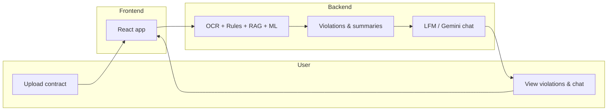

# Legato / GP-Legal-AI — Project Guide

A single document to understand the project: why each part exists, how it connects, and how to remember it. Audience: someone smart but new to the codebase. For deeper technical detail, see the docs linked at the end of each section.

---

## 1. Mental model / big picture

**Contract in → analysis and chat out.**

1. User uploads a contract (PDF, DOCX, or image) in the **frontend**.
2. **Backend** runs OCR (text extraction), rule-based checks, RAG (retrieve relevant law), and ML (predict which rules apply).
3. The result is **violations** (rule hits) and **summaries** (e.g. labor, cross-border).
4. User can **chat** about the contract: either with a **local LLM (LFM)** on the analyze page, or with **Gemini** on the chat page (context = saved analysis).

**How to remember:** "Upload → OCR + rules + RAG + ML → violations → chat."

---

## 2. Frontend (high level)

**What it does:** Login, register (with email verification), forgot/reset password, analyze contracts, view history, chat with an analysis, admin (list users/analyses).

**Key folders:**

- **`src/pages`** — One React component per screen: `LoginPage`, `RegisterPage`, `ForgotPasswordPage`, `ResetPasswordPage`, `GoogleCallbackPage`, `AnalyzePage`, `HistoryPage`, `ChatPage`, `AdminPage`.
- **`src/lib`** — Shared logic: `api.ts` (all backend HTTP calls), `auth.ts` (login, register, me, logout, token in `localStorage`).
- **`src/components`** — Reusable UI: `AppShell`, `AuthLayout`, `ProtectedRoute`, and shadcn-style components (Button, Card, Table, Tabs, etc.).

**File-by-file (short):**

| File | Purpose |
|------|--------|
| `App.tsx` | Routes, auth gate: calls `me()` on load; shows `LoadingScreen` until ready; protects `/analyze`, `/history`, `/chat`, `/admin`. |
| `AnalyzePage.tsx` | Upload file, run analysis (OCR + check), show violations/tabs, save to DB, LFM document chat. |
| `HistoryPage.tsx` | List saved analyses, load/delete/export, navigate to analyze or chat. |
| `ChatPage.tsx` | Select a saved analysis, chat with Gemini (context = that analysis). Core details and document name come from the selected analysis. |
| `api.ts` | Axios instance + helpers: `analyzeContract`, `saveAnalysisToDb`, `listAnalyses`, `getAnalysis`, `chatMessage`, `chatWithDocument`, admin APIs. |
| `auth.ts` | `login`, `register`, `me`, `logout`; stores `access_token` in `localStorage`. |

**How to remember:** "Pages = screens; lib = shared logic and API."

---

## 3. Backend API (high level)

**What it does:** Auth (register, login, forgot/reset password, Google OAuth, email verification), store analyses, run OCR + rules + RAG + ML, serve chat (Gemini and LFM).

**Key folders:**

- **`app/routers`** — Endpoints: `auth.py`, `chat.py`, `analyses.py`, etc.
- **`app/core`** — Shared auth/security: `security.py` (passwords, JWT), `deps.py` (get_current_user).
- **`app/db`** — Models, session, `init_db`.
- **`app/main.py`** — FastAPI app, CORS, startup (DB, Chroma, retriever), and the main **OCR + check** pipeline.

**File-by-file (short):**

| File | Purpose |
|------|--------|
| `main.py` | FastAPI app, CORS, custom exception handlers (so CORS headers are on all responses). On startup: init DB, init RAG (Chroma or Legal Rag bridge), load ML predictor. Defines `ocr_check_and_search`: OCR → rules → RAG → ML → labor/cross-border summaries → response. |
| `routers/auth.py` | Register (with email verification code), login (blocks unverified email), forgot-password (sends code), verify-reset-code, reset-password, verify-email; Google OAuth (`/auth/google`, `/auth/google/callback`). |
| `routers/chat.py` | `/chat/message` (Gemini, context = analysis), `/chat/document` (local LFM, context = document_context or analysis). Handles 429/quota with a user-friendly message. |
| `routers/analyses.py` | CRUD for analyses (save, list, get, delete); admin list all. |
| `core/security.py` | Password hashing (PBKDF2-SHA256), JWT create/verify. |
| `core/deps.py` | `get_current_user` dependency (JWT from Authorization header). |

**How to remember:** "Routers = endpoints; core = shared auth/security; main = app + pipeline."

---

## 4. RAG and retrieval

**Purpose:** Find relevant law chunks for a contract or a question — like a librarian: you ask, they return the most relevant paragraphs from the law books.

**Key files:**

- **`app/legal_rag_bridge.py`** — Bridge to Legal Rag (VectorStore, RAGEngine); uses Legal Rag config and paths.
- **`app/rag_utils.py`** — Embeddings (e.g. SentenceTransformer), FAISS or similar in-memory retriever, cosine similarity.
- **`app/rag_chromadb.py`** — ChromaDB vector store over law chunks.
- **`app/chunks_loader.py`** — Load law chunks for RAG.

**Algorithms (see [ALGORITHMS_USED.md](ALGORITHMS_USED.md)):** SentenceTransformer (dense embeddings), ChromaDB (HNSW, cosine), FAISS, cosine similarity, BM25, TF-IDF reranking.

**How to remember:** "RAG = retrieve relevant law chunks; bridge to Legal Rag or Chroma/FAISS."

---

## 5. ML and violations

**Purpose:** Predict which rules are relevant (or violated) from contract text. Like a checklist: the model scores each rule; high score = likely violation; then the rule engine can confirm with regex.

**Key files:**

- **`app/model_ml_predictor.py`** / **`app/ml_predictor.py`** — Load model, `predict_rule_scores_full`, `predict_rule_ids` (shortlist of rules to run).
- **`app/train_ml_predictor.py`** — Training with weak (silver) labels from the rule engine.
- **`app/main.py`** — Pipeline: OCR → rule engine + ML shortlist → RAG → labor/cross-border summaries; violations = rule hits + ML.

**Algorithms (see [ALGORITHMS_USED.md](ALGORITHMS_USED.md), [ML_AND_VIOLATIONS.md](ML_AND_VIOLATIONS.md), [HOW_ML_DETECTS_VIOLATIONS.md](HOW_ML_DETECTS_VIOLATIONS.md)):** TF-IDF, BM25, Logistic Regression, OneVsRest, thresholds; weak labels from rule engine.

**How to remember:** "ML shortlists which rules to run; rules + RAG give violations and summaries."

---

## 6. LLM (LFM and Gemini)

**Purpose:** Answer questions about the contract. Two paths:

- **LFM (local)** — On the analyze page: document Q&A using a local model (`llm/generate.py` or `app/local_llm.py`). Context = OCR + violations + summaries; prompt is built in the backend, not shown in the frontend.
- **Gemini (cloud)** — On the chat page: contract-aware chat for a **saved** analysis. Context = OCR + violations + summaries for that analysis; user selects an analysis, then chats.

**Key files:**

- **`llm/generate.py`** — Local LLM: `is_available`, `generate_answer`.
- **`app/local_llm.py`** — Fallback local LLM (e.g. LFM2.5-1.2B-Instruct).
- **`app/routers/chat.py`** — `/chat/message` (Gemini), `/chat/document` (LFM). Builds context from analysis `result_json`; 429/quota handled with a friendly message.

**How to remember:** "LFM = on your machine; Gemini = in the cloud; both get context (OCR + violations) and answer questions."

---

## 7. Security and auth

**Purpose:** Passwords are hashed and never stored in plain text; sessions are a signed token (JWT).

**Key files:**

- **`app/core/security.py`** — Hashing (PBKDF2-SHA256 via passlib), JWT create/validate (HS256).
- **`app/routers/auth.py`** — Register (with email verification code), login (requires verified email), forgot-password (code sent by email), verify-reset-code, reset-password, verify-email; Google OAuth. Seed admin (`admin@test.com`) is kept verified in `init_db` so it can log in without verification.

**Flow:** Register → email with code → user verifies → can login. Forgot password → email with code → verify code → reset token → set new password.

**How to remember:** "Passwords hashed; JWT for sessions; email codes for verification and reset."

---

## 8. Data flow summary

### How a contract gets analyzed

1. User selects a file on **AnalyzePage** and clicks analyze.
2. Frontend calls **`POST /ocr_check_and_search`** (or equivalent) with the file.
3. **Backend** (`main.py` pipeline): OCR (DocumentAI or PyMuPDF/tesseract) → normalize text → rule engine (YAML regex) + ML shortlist → RAG (retrieve law chunks) → labor/cross-border summaries → **rule_hits** + **ocr_chunks** + **labor_summary** + **cross_border_summary** + optional **rag_by_violation** (LLM explanations).
4. Response is shown in the UI (tabs, violations, summaries). User can save to DB; then they can open that analysis in Chat or History.

### How chat gets context

- **LFM (analyze page):** Frontend sends **document_context** (OCR + violations + summaries, built in frontend from current `data`) + **message**. Backend does not expose the full system prompt to the client.
- **Gemini (chat page):** User picks a saved analysis. Frontend sends **analysis_id** + **message**. Backend loads that analysis’s `result_json`, builds context (OCR + violations + summaries), and sends that + the user message to Gemini.

### "I want to change X" → where to look

| Goal | Look in |
|------|--------|
| Change login/register/forgot flow | `app/routers/auth.py`, frontend `LoginPage`, `RegisterPage`, `ForgotPasswordPage` |
| Change analysis pipeline (OCR, rules, ML, RAG) | `app/main.py` |
| Change what the chatbot sees (context) | `app/routers/chat.py` (`_build_context`, `_build_document_chat_prompt`) |
| Change RAG retrieval | `app/legal_rag_bridge.py`, `app/rag_utils.py`, `app/rag_chromadb.py` |
| Change ML model or training | `app/ml_predictor.py`, `app/model_ml_predictor.py`, `app/train_ml_predictor.py` |
| Change frontend API calls | `legalai-frontend/.../src/lib/api.ts` |
| Env vars (API keys, DB, URLs) | `.env`, `docs/ENV_SETUP.md` |

---

## References (existing docs)

- [ALGORITHMS_USED.md](ALGORITHMS_USED.md) — Algorithms (TF-IDF, BM25, Logistic Regression, etc.) and where they are used.
- [ML_AND_VIOLATIONS.md](ML_AND_VIOLATIONS.md) — ML model, violations, weak labels, pipeline.
- [HOW_ML_DETECTS_VIOLATIONS.md](HOW_ML_DETECTS_VIOLATIONS.md) — How ML detects violations.
- [DATA_LABELS_AND_RAG.md](DATA_LABELS_AND_RAG.md) — Data labels and RAG.
- [ENV_SETUP.md](ENV_SETUP.md) — Environment variables and setup.
