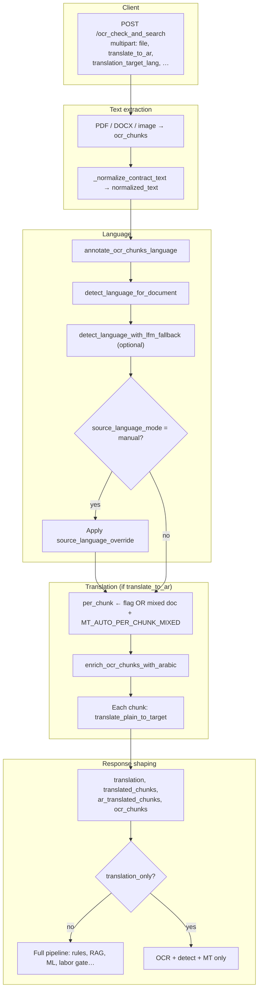
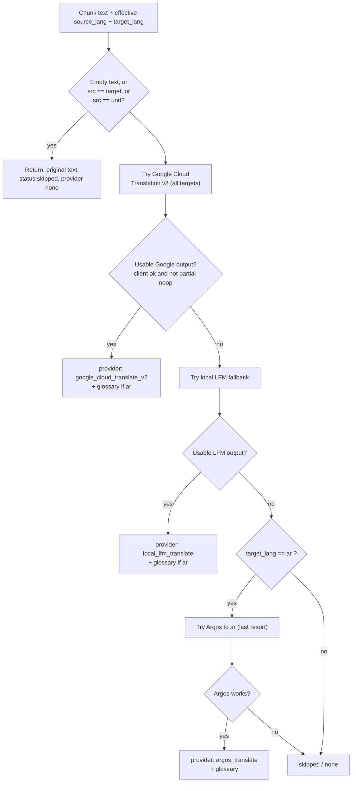
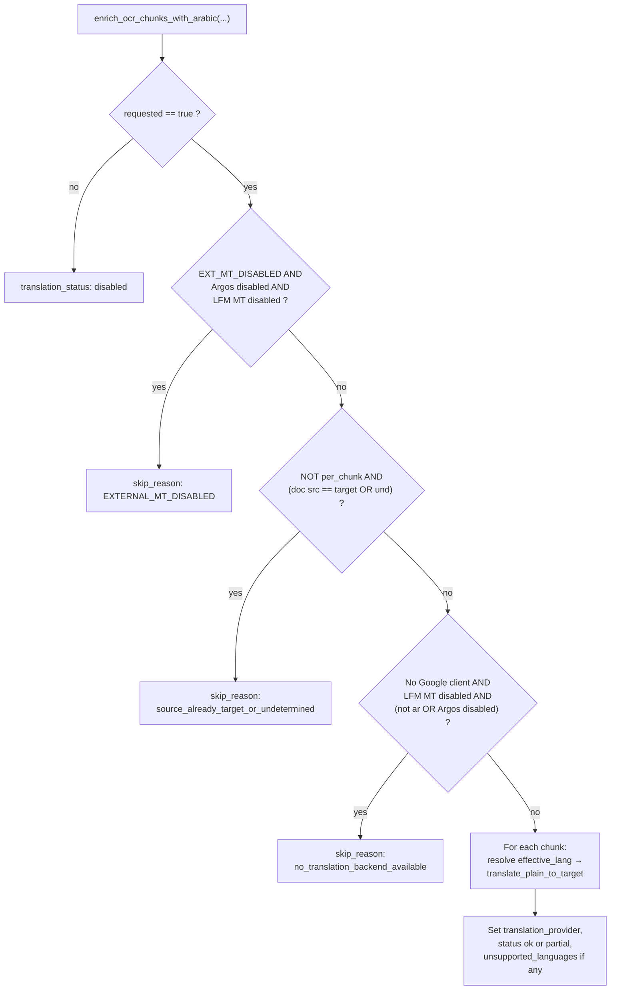

# Translation in GP Legal AI — Technical Report

This document describes how **machine translation** is implemented, configured, tested, and exposed in this repository.

---

## 1. Purpose and scope

Translation is **contract-focused machine translation** wired into `POST /ocr_check_and_search`. It runs on **OCR chunks** after text normalization, enriches each chunk with translated fields, and returns **metadata** (`translation`, `translated_chunks`, `ar_translated_chunks`, etc.).

It is separate from **string digit/script transforms** elsewhere (for example `str.translate` for Arabic indic digits in ML code), which are not product “MT.”

---

## Flow diagrams

The diagrams below use names that match the codebase (`main.py`, `translation_service.py`, `utils_text.py`).

### End-to-end: analyze upload through translation

### Provider selection: `translate_plain_to_target`

### Gates inside `enrich_ocr_chunks_with_arabic`

---

## 2. Where the logic lives

| Area | Role |
|------|------|
| `app/translation_service.py` | Core MT: providers, chunking, glossary, cache, `enrich_ocr_chunks_with_arabic`, `translate_plain_to_target` |
| `app/main.py` (`ocr_check_and_search`) | Form parameters, validation, calls enrichment, builds response slices; **labor gate** uses translated text when MT ran |
| `app/utils_text.py` | Per-chunk and document **language detection** (feeds source language and `per_chunk` behavior) |
| `data/legal_mt_glossary_v1.json` | Post-MT **glossary** (global + `by_source`) for Arabic output |
| `legalai-frontend/legalai-frontend/src/lib/api.ts` | Multipart fields for analyze |
| `legalai-frontend/legalai-frontend/src/pages/AnalyzePage.tsx` | User toggles: translate, per-chunk MT, translation-only, source mode/override, target language |
| `docs/API_CONTRACT.md` | Contract for translation-related request/response fields |
| `app/tests/test_language_and_translation.py` | Detection, glossary, Google mock, local LFM mock, labor content gating |

---

## 3. Translation backends and order of use

The public entry for a single string is `translate_plain_to_target` in `translation_service.py`. **Automatic** order for all supported targets (`ar`, `en`, `fr`, `de`):

1. **Google Cloud Translation v2** (`google_cloud_translate_v2`) — when `GOOGLE_TRANSLATION_API_KEY` is set, the app uses the **public REST** endpoint (`?key=…`); when only ADC/service account is configured, it uses `google.cloud.translate_v2.Client()`. `EXTERNAL_MT_DISABLED` and `DISABLE_GOOGLE_MT` must be off. Chunk size 4500. Retries with backoff. Glossary applied after Google for Arabic. If Google is unusable (no client, or partial with unchanged text), the code **falls back** to LFM.

2. **Local LFM** (`local_lfm_translate`) — when `ENABLE_LOCAL_LLM_TRANSLATION` is not disabled and `app.local_llm` is available. Chunks of `_ARGOS_CHUNK_CHARS` (1200). Glossary applied for Arabic target after LFM.

3. **Argos Translate** (`argos_translate`) — offline **to Arabic only**, used **only when both Google and LFM failed** for an Arabic target; same 1200-char chunks; skipped when `DISABLE_ARGOS_MT` is set.

For **`en`, `fr`, `de`**, if both Google and LFM fail, the function returns the original text with provider `none` and status `skipped` (no Argos path).

`translate_plain_to_arabic` is a thin wrapper calling `translate_plain_to_target(..., target_lang="ar")`.

---

## 4. OCR enrichment (`enrich_ocr_chunks_with_arabic`)

Despite the name, this function supports **any supported target** (`ar`, `en`, `fr`, `de`): it sets `translated_text` on every chunk and sets `translated_ar_text` when the target is Arabic (for backward compatibility).

### Gating / skip reasons (high level)

- `requested=False` → `translation_status: disabled`.
- `EXTERNAL_MT_DISABLED` **and** `DISABLE_ARGOS_MT` **and** local LFM MT disabled (`ENABLE_LOCAL_LLM_TRANSLATION=0`) → early skip (`skip_reason: EXTERNAL_MT_DISABLED`).
- Document-level skip when **not** `per_chunk` and source is already the target or undetermined (`source_already_target_or_undetermined`).
- **Google client unavailable** and **Argos disabled** and **local LFM MT disabled** → `google_translate_client_unavailable_and_argos_disabled`. If LFM MT is enabled, enrichment still runs so Arabic can use LFM fallback.

### Per-chunk behavior

When `per_chunk` is true, each chunk uses `detected_lang` when present, else document-level source. In `main.py`, `per_chunk` is enabled when the client sends `translate_per_chunk_mt` **or** when the document is mixed-language and `MT_AUTO_PER_CHUNK_MIXED` is enabled (default on).

**Note:** The multipart flag remains **`translate_to_ar`** even when `translation_target_lang` is not Arabic; see API contract for the newer target field.

---

## 5. Glossary and caching

- **Glossary:** `load_glossary_pairs_for_source` merges global `pairs` with `by_source[<iso2>]` from `data/legal_mt_glossary_v1.json`. Terms shorter than 4 characters are ignored in `_apply_glossary_ar` (case-insensitive regex substitution). Applied after MT for **Arabic target** (Google, Argos, and local LFM Arabic path).

- **Caching:** In-memory cache (512 entries) keyed by backend + source language + text; optional **disk** cache under `LEGALAI_MT_CACHE_DIR` (JSON per hash).

---

## 6. Language detection (feeds translation)

- After normalization, `annotate_ocr_chunks_language` sets `detected_lang` / `detected_lang_confidence` per chunk.
- Document-level `detect_language_for_document` refines mixed-language detection.
- Optional **LFM LID fallback** when confidence is low (`detect_language_with_lfm_fallback` in `main.py`).
- Manual override: `source_language_mode=manual` + `source_language_override` (BCP-47 validated by `is_valid_bcp47_primary_override` in `utils_text.py`).

This affects which **source** code is passed into MT and whether **per-chunk** mode auto-enables for mixed documents.

---

## 7. Downstream pipeline behavior

- **Labor applicability / Egyptian labor content:** When translation ran with a provider, `gate_text` prefers joined `translated_ar_text` for gating; otherwise original `full_text`. That steers `_labor_applicability` and `_egyptian_labor_content_related` so analysis is not mis-applied to obviously foreign-only employment text that was translated for display.

- **`translation_only`:** Skips ML, RAG, rules, labor/cross-border summaries; response is essentially OCR + detection + optional translation.

- **Argos hint:** If provider is `argos_translate`, metadata may include `full_arabic_hint` pointing users to Google for fuller Arabic.

---

## 8. API and clients

**Backend** (`main.py`): `translation_target_lang` validated to `ar|en|fr|de`. Other multipart fields: `translate_to_ar`, `translate_per_chunk_mt`, `translation_only`, `source_language_mode`, `source_language_override`.

**Frontend** (`api.ts` + `AnalyzePage.tsx`): Maps options to those form fields; `hasArabicTranslation` checks both `translated_text` and `translated_ar_text` on chunks.

**Docs** (`docs/API_CONTRACT.md`): Describes `translated_chunks`, top-level `translation_target_lang`, and compatibility field `ar_translated_chunks`.

---

## 9. Configuration (environment)

| Variable | Effect |
|----------|--------|
| `ENABLE_LOCAL_LLM_TRANSLATION` | Default-on style: set `0`/`false`/`no` to disable LFM MT |
| `GOOGLE_TRANSLATION_API_KEY` / `GOOGLE_APPLICATION_CREDENTIALS` | Google Translation v2 client |
| `EXTERNAL_MT_DISABLED` | Blocks Google client factory |
| `DISABLE_GOOGLE_MT` | Skips Google even if credentials exist |
| `DISABLE_ARGOS_MT` | Disables Argos |
| `MT_AUTO_PER_CHUNK_MIXED` | Default on; set `0` to not auto-enable per-chunk for mixed docs |
| `LEGALAI_MT_CACHE_DIR` | Optional disk cache for MT chunks |

`.env.example` documents **local LFM** and **`GOOGLE_TRANSLATION_API_KEY`** but may not list all MT toggles; see `app/translation_service.py` and `app/core/config.py` for full behavior.

---

## 10. Dependencies

`requirements.txt`: `google-cloud-translate` (optional GCP MT), `argostranslate` (pinned `<1.10.0`) for offline Arabic.

---

## 11. Testing

`app/tests/test_language_and_translation.py` covers: BCP-47 override, locales for LLM prompts, detection on several languages, chunk annotation + mixed document, enrichment when not requested, **mocked Google** path (with local LFM disabled), **Google-unavailable and Google-noop fallbacks to LFM**, glossary merge for French, **mocked local LFM** for `de` target, LID LFM fallback, FastText fusion, and **Egyptian labor content** gating on translated vs foreign-context Arabic.

---

## 12. Limitations and naming quirks

1. **Flag name `translate_to_ar`** is legacy; it gates **any** supported `translation_target_lang`, not only Arabic.

2. **Non-Arabic targets** use **Google then LFM**; Argos is not used.

3. **`enrich_ocr_chunks_with_arabic`** early exits when no backend remains (Google off, LFM MT off, and for Arabic either Argos off or non-ar target).

4. **Glossary** is Arabic-oriented; for `en`/`fr`/`de` targets, glossary application in `translate_plain_to_target` is tied to `target == "ar"`.

---

## 13. Summary

Translation in this project is a **server-side, automatic, chunk-based** pipeline: **Google v2** runs first for all supported targets, then **local LFM**, then **Argos** only as a last resort for Arabic, plus a **legal glossary** for Arabic post-processing, **caching**, and coupling to **language detection** and **per-chunk** mixed-document handling. Clients choose target language only (no provider field); **`docs/API_CONTRACT.md`** documents the response shape.

---

*Generated for repository maintenance; update this file when translation behavior or contracts change.*
