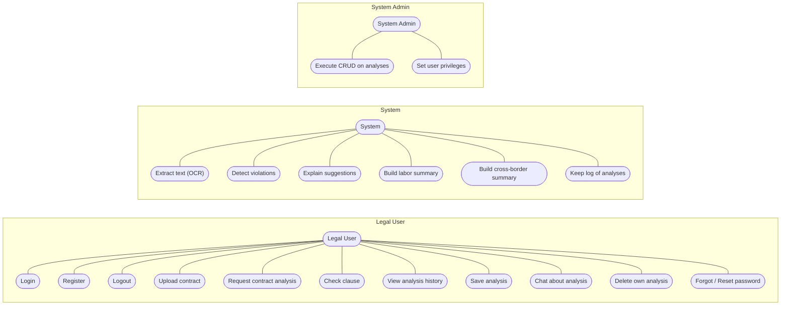
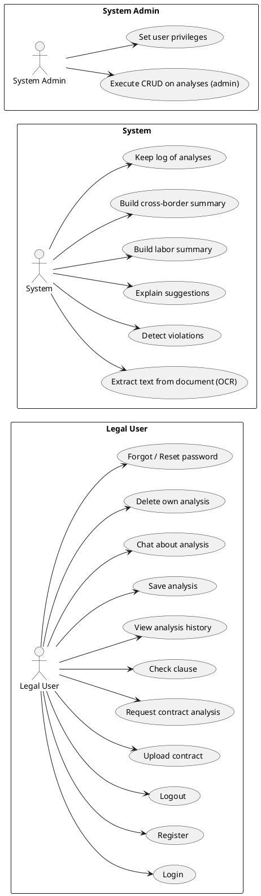

# 3.2.1 System Functions

**Figure 3.1: Use case diagram – GP-Legal-AI**

Three actors: **Legal User** (left), **System** (center), **System Admin** (right). Use cases are ovals; lines connect each actor to the use cases they perform or interact with. Layout is horizontal so the three groups sit beside each other.

## Mermaid (view in Markdown / GitHub)



---

## PlantUML source (for draw.io or PlantUML)

Use the following in [PlantUML](https://www.plantuml.com/plantuml) or import into draw.io for a classic UML use case layout with stick figures and ovals:



Copy the PlantUML block (from `@startuml` to `@enduml`) into PlantUML or a tool that supports it to get stick figures and oval use cases like the reference diagram.

---

## 3.2.2 Functional Requirements (copy-paste list)

**System requirements**

1. The system shall provide recommended violation findings and labor/cross-border summaries for uploaded contracts, to assist in decision making. (S01)

2. The system shall provide explanations of recommendations in the forms of rule hits, severity, matched text, labor summary, and cross-border summary in real-time and for later review. (S02)

3. The system shall be able to extract text from documents (OCR), split clauses, run ML-based violation detection and RAG retrieval, and produce structured analysis results while ensuring consistency with Egyptian labor law scope. (S03)

4. The system shall determine labor-law applicability (Egypt vs foreign jurisdiction) for cross-border contracts and indicate when Egyptian labor law does not apply. (S04)

**Legal User requirements**

5. The legal user shall be able to log in to the system with their credentials (email/password or Google OAuth). (C01)

6. The legal user shall be able to register an account. (C02)

7. The legal user shall be able to upload contract documents (PDF, DOCX, or image) for analysis. (C03)

8. The legal user shall be able to view the reasoning behind the system’s recommendations (rule IDs, descriptions, severity, matched text) to ensure trust in the output. (C04)

9. The legal user shall be able to view analysis results and chat about a specific analysis in context for clear understanding of recommendations. (C05)

10. The legal user shall be able to request a single-clause check or re-upload and re-analyze a contract in case the initial recommendation is deemed unsuitable. (C06)

11. The legal user shall be able to save analyses, view analysis history, and delete their own analyses. (C07)

12. The legal user shall be able to request a password reset via email (forgot/reset password). (C08)

**Admin requirements**

13. The admin shall be able to add/edit/delete/view user accounts in the database, alongside determining the level of user privileges in the system. (A01)

14. The admin shall be able to view all analyses and list analyses by user for monitoring and support. (A02)

15. The admin shall be able to provide feedback to the system to improve the model’s performance. (A03)

---

## 3.2.3 Functional Requirement Specifications

For each requirement below: **Name**, **Code**, **Priority**, **Critical**, **Description**, **Input**, **Output**, **Pre-condition**, **Post-condition**, **Dependency**, **Risk**.

### S01 – Provide Contract Violation Recommendations

| Attribute | Value |
|----------|--------|
| **Name** | Provide Contract Violation Recommendations |
| **Code** | S01 |
| **Priority** | Extreme |
| **Critical** | This requirement is one of the main purposes of the system, as it assists legal users in decision making by surfacing potential labor-law violations and cross-border applicability, and consequently reduces manual review effort. |
| **Description** | Analyzes uploaded contract text and extracted clauses to output violation findings (rule hits) and labor/cross-border summaries. |
| **Input** | Contract document (PDF/DOCX/image), extracted text, law scope (e.g. labor), optional RAG query. |
| **Output** | Rule hits (rule_id, description, severity, matched text), labor summary, cross-border summary, violation risk indicators. |
| **Pre-condition** | Document uploaded and text extracted; ML model and RAG index available. |
| **Post-condition** | Recommendations and summaries available for display and optional save. |
| **Dependency** | The output of this requirement is necessary for S02, as it will need to be explained to ensure interpretability. |
| **Risk** | None |

### S02 – Provide Explanations of Recommendations

| Attribute | Value |
|----------|--------|
| **Name** | Provide Explanations of Recommendations |
| **Code** | S02 |
| **Priority** | Extreme |
| **Critical** | Ensures interpretability and trust in the system output; users must understand why a recommendation was made. |
| **Description** | Presents recommendations in the forms of rule hits, severity, matched text, labor summary, and cross-border summary in real-time and for later review. |
| **Input** | Analysis result (rule hits, labor summary, cross-border summary) from S01/S03. |
| **Output** | Structured explanations (rule IDs, descriptions, severity, matched text, labor/cross-border summaries) in UI or API response. |
| **Pre-condition** | Analysis has been run (S01/S03); user or admin is viewing results. |
| **Post-condition** | User can review and understand the reasoning behind each recommendation. |
| **Dependency** | Requires output of S01/S03. |
| **Risk** | None |

### S03 – Analyze Contract for Violations

| Attribute | Value |
|----------|--------|
| **Name** | Analyze Contract for Violations |
| **Code** | S03 |
| **Priority** | Extreme |
| **Critical** | Core pipeline that produces all violation and summary data; without it no recommendations can be provided. |
| **Description** | Extracts text from documents (OCR), splits into clauses, runs ML-based violation detection and RAG retrieval, and produces structured analysis results while ensuring consistency with Egyptian labor law scope. |
| **Input** | Raw document bytes (PDF/DOCX/image), optional query, RAG/law chunks, ML model. |
| **Output** | OCR chunks, clause spans, rule hits, labor summary, cross-border summary, full result JSON. |
| **Pre-condition** | Document uploaded; retriever and ML model loaded. |
| **Post-condition** | Complete analysis result available for display, explanation (S02), and optional persistence. |
| **Dependency** | OCR, chunks index, ML model; feeds S01 and S02. |
| **Risk** | None |

### S04 – Determine Labor-Law Applicability

| Attribute | Value |
|----------|--------|
| **Name** | Determine Labor-Law Applicability |
| **Code** | S04 |
| **Priority** | High |
| **Critical** | Prevents incorrect application of Egyptian labor law to contracts governed by foreign jurisdiction. |
| **Description** | For cross-border contracts, determines whether Egyptian labor law applies or foreign jurisdiction applies based on contract text signals (e.g. governing law, venue). |
| **Input** | Full contract text, cross-border detection signals. |
| **Output** | Applicability status (applicable / not_applicable), jurisdiction (EG / FOREIGN), reason. |
| **Pre-condition** | Contract text available; cross-border detection has been run. |
| **Post-condition** | User and summaries know whether Egyptian labor law applies to the contract. |
| **Dependency** | Cross-border detector; used in labor summary and S01/S02. |
| **Risk** | None |

### C01 – Log In to System

| Attribute | Value |
|----------|--------|
| **Name** | Log In to System |
| **Code** | C01 |
| **Priority** | Extreme |
| **Critical** | Required for all authenticated operations; no analysis or history without login. |
| **Description** | Allows the legal user to authenticate using email/password or Google OAuth. |
| **Input** | Email and password, or OAuth token from Google. |
| **Output** | Access token (JWT) and user identity. |
| **Pre-condition** | User has an account (or completes registration); auth service and DB available. |
| **Post-condition** | User is logged in and can access protected endpoints. |
| **Dependency** | Auth router, user database; required for C03–C08. |
| **Risk** | None |

### C02 – Register Account

| Attribute | Value |
|----------|--------|
| **Name** | Register Account |
| **Code** | C02 |
| **Priority** | High |
| **Critical** | Allows new users to access the system; without registration only pre-created accounts could be used. |
| **Description** | Allows a new user to create an account with email and password. |
| **Input** | Email, password. |
| **Output** | User record created; user can log in (C01). |
| **Pre-condition** | Email not already registered; valid email format and password policy. |
| **Post-condition** | User account exists; user can log in. |
| **Dependency** | Auth router, user database. |
| **Risk** | None |

### C03 – Upload Contract for Analysis

| Attribute | Value |
|----------|--------|
| **Name** | Upload Contract for Analysis |
| **Code** | C03 |
| **Priority** | Extreme |
| **Critical** | Entry point for contract analysis; primary user action to obtain recommendations. |
| **Description** | Allows the legal user to upload contract documents (PDF, DOCX, or image) for analysis. |
| **Input** | File (PDF/DOCX/image), optional parameters (use_rag, use_ml, save). |
| **Output** | Analysis result (rule hits, summaries) or OCR text only if only OCR requested. |
| **Pre-condition** | User logged in; file within size/type limits. |
| **Post-condition** | Document processed; analysis result returned and optionally saved. |
| **Dependency** | S03 pipeline, C01; optionally C07 (save). |
| **Risk** | None |

### C04 – View Reasoning Behind Recommendations

| Attribute | Value |
|----------|--------|
| **Name** | View Reasoning Behind Recommendations |
| **Code** | C04 |
| **Priority** | Extreme |
| **Critical** | Ensures trust in the output; users must see rule IDs, descriptions, severity, and matched text to verify recommendations. |
| **Description** | Allows the legal user to view the reasoning behind the system’s recommendations (rule IDs, descriptions, severity, matched text). |
| **Input** | Analysis ID or analysis result (rule hits). |
| **Output** | Display of reasoning (rule hits, severity, matched text) in UI. |
| **Pre-condition** | User logged in; analysis exists and user has access. |
| **Post-condition** | User can verify and trust recommendations. |
| **Dependency** | S02 output; analyses API (get analysis by ID). |
| **Risk** | None |

### C05 – View Analysis Results and Chat

| Attribute | Value |
|----------|--------|
| **Name** | View Analysis Results and Chat |
| **Code** | C05 |
| **Priority** | High |
| **Critical** | Supports clear understanding and follow-up questions in context of a specific analysis. |
| **Description** | Allows the legal user to view full analysis results and chat about a specific analysis in context (contract text and rule hits). |
| **Input** | Analysis ID, chat message, optional conversation history. |
| **Output** | Rendered analysis result; chat response (e.g. Gemini) in context of that analysis. |
| **Pre-condition** | User logged in; analysis exists and user has access; chat API (e.g. GEMINI_API_KEY) configured for chat. |
| **Post-condition** | User has viewed results and/or received chat reply. |
| **Dependency** | S01/S02/S03 output; chat router; C01, C07 (view history). |
| **Risk** | Chat unavailable if API key not set. |

### C06 – Request Single-Clause Check or Re-Analyze

| Attribute | Value |
|----------|--------|
| **Name** | Request Single-Clause Check or Re-Analyze |
| **Code** | C06 |
| **Priority** | High |
| **Critical** | Allows user to refine or challenge initial recommendation when deemed unsuitable. |
| **Description** | Allows the legal user to run a single-clause check or re-upload and re-analyze a contract when the initial recommendation is deemed unsuitable. |
| **Input** | Clause text (for single-clause check) or new file upload (for re-analyze). |
| **Output** | Clause check result (matches, ML scores) or full analysis result. |
| **Pre-condition** | User logged in; clause text or file provided. |
| **Post-condition** | User has alternative or updated recommendation. |
| **Dependency** | S03, check_clause endpoint, OCR+analysis pipeline. |
| **Risk** | None |

### C07 – Save, View, and Delete Analyses

| Attribute | Value |
|----------|--------|
| **Name** | Save, View, and Delete Analyses |
| **Code** | C07 |
| **Priority** | High |
| **Critical** | Allows users to keep a history of analyses and manage their own data. |
| **Description** | Allows the legal user to save analyses, view analysis history, and delete their own analyses. |
| **Input** | For save: analysis result and metadata (e.g. from C03 with save=true). For view: none (list) or analysis ID. For delete: analysis ID. |
| **Output** | List of analyses (view) or confirmation (save/delete). |
| **Pre-condition** | User logged in; for save, analysis just run; for delete, user owns analysis or is admin. |
| **Post-condition** | Analysis persisted or removed; history updated. |
| **Dependency** | Analyses API, database; C01. |
| **Risk** | None |

### C08 – Request Password Reset

| Attribute | Value |
|----------|--------|
| **Name** | Request Password Reset |
| **Code** | C08 |
| **Priority** | Medium |
| **Critical** | Allows users to recover access without admin intervention. |
| **Description** | Allows the legal user to request a password reset via email (forgot password) and complete reset with token (reset password). |
| **Input** | Email (forgot password); token and new password (reset password). |
| **Output** | Reset email sent (forgot); password updated (reset). |
| **Pre-condition** | Valid email (forgot); valid unexpired token (reset); SMTP configured for email. |
| **Post-condition** | User can log in with new password. |
| **Dependency** | Auth router, SMTP (optional), frontend reset link. |
| **Risk** | Email delivery failure if SMTP not configured. |

### A01 – Manage User Accounts and Privileges

| Attribute | Value |
|----------|--------|
| **Name** | Manage User Accounts and Privileges |
| **Code** | A01 |
| **Priority** | Extreme |
| **Critical** | Required for access control and admin operations; determines who can use the system and who has admin rights. |
| **Description** | Allows the admin to add, edit, delete, and view user accounts in the database and set the level of user privileges (e.g. admin role). |
| **Input** | User data (add/edit), user ID (delete/view), role/privilege level. |
| **Output** | User list or updated/deleted user record. |
| **Pre-condition** | Admin logged in; user DB available; user-management API or script (e.g. make_admin). |
| **Post-condition** | User accounts and privileges updated. |
| **Dependency** | User model, admin role check. |
| **Risk** | None |

### A02 – View All Analyses and List by User

| Attribute | Value |
|----------|--------|
| **Name** | View All Analyses and List by User |
| **Code** | A02 |
| **Priority** | High |
| **Critical** | Enables monitoring and support; admin can inspect any user’s analyses. |
| **Description** | Allows the admin to view all analyses and list analyses by user for monitoring and support. |
| **Input** | None (all analyses) or user ID (analyses by user). |
| **Output** | List of analyses with details (admin/all, admin/user/{id}). |
| **Pre-condition** | Admin logged in. |
| **Post-condition** | Admin has visibility over analyses. |
| **Dependency** | Analyses API (admin endpoints), C01 (admin role). |
| **Risk** | None |

### A03 – Provide Feedback to Improve Model

| Attribute | Value |
|----------|--------|
| **Name** | Provide Feedback to Improve Model |
| **Code** | A03 |
| **Priority** | Medium |
| **Critical** | Enables continuous improvement of the model’s performance over time. |
| **Description** | Allows the admin to provide feedback to the system to improve the model’s performance (e.g. for future training or tuning). |
| **Input** | Feedback data (e.g. analysis ID, correction, rating); mechanism is implementation-dependent. |
| **Output** | Feedback recorded (implementation-dependent). |
| **Pre-condition** | Admin logged in; feedback mechanism available. |
| **Post-condition** | Feedback stored for model improvement. |
| **Dependency** | Future feedback API or process; A01. |
| **Risk** | Low if feedback mechanism not yet implemented. |

---

## 3.3.1 User Interfaces

The web application provides a structured and intuitive user interface to facilitate seamless interaction with the AI-powered contract analysis system. The primary user interfaces are as follows:

**1. Secure Login Screen**  
The application begins with a secure login screen that ensures authorized access. Users must authenticate using their credentials (email/password or Google OAuth) before proceeding to the main dashboard. New users can register an account; existing users can request a password reset via email. This enhances security by restricting access to sensitive contract data and system functionalities.

**2. Main Dashboard**  
The main dashboard serves as the central hub, aggregating all essential functions in a user-friendly layout. It provides a quick overview of the system’s capabilities, ensuring users can navigate efficiently to different sections, including contract upload and analysis, analysis history, chat about analyses, and (for admins) user management and view-all-analyses.

**3. Real-Time Contract Analysis & Violation Findings**  
This dynamic section presents real-time contract analysis results based on AI and RAG. The user uploads a contract (PDF, DOCX, or image); the system extracts text, splits clauses, runs violation detection, and displays findings. An interactive view shows rule hits, labor summary, and cross-border summary, allowing users to assess potential violations and jurisdiction. The flow provides a hands-on approach to understanding AI-generated recommendations and their impact on the contract.

**4. AI Reasoning & Transparency Panels**  
Dedicated panels offer detailed breakdowns of the AI’s decision-making process. These panels include:

- **Statistics** summarizing key factors: number of rule hits, severity breakdown (e.g. high/medium), labor summary status (e.g. annual leave, probation), and cross-border applicability.
- **Structured rule hits** listing rule ID, description, severity, and matched text for each potential violation, so users can see exactly which clauses triggered which rules.
- **Textual insights** explaining the reasoning behind each suggestion (e.g. labor summary messages, cross-border jurisdiction reason), enhancing transparency and trust in the system’s decisions.

Optionally, a **chat panel** allows the user to ask follow-up questions in context of a specific analysis (contract text and rule hits), for further clarification of the AI’s reasoning.

---

## 3.3.2 CLI (Command-Line Interface)

The project provides several command-line entry points for running the API server, admin tasks, training, evaluation, and preprocessing. For each command, arguments and example invocations are given. Run scripts from the **project root** unless otherwise noted.

### 1. Run the API server

Starts the FastAPI backend (web UI is served separately by the frontend dev server or Docker).

| Argument | Description | Example value |
|----------|-------------|---------------|
| (none) | Default: `app.main:app` | — |
| `--host` | Bind host | `0.0.0.0` |
| `--port` | Port number | `8000` |
| `--reload` | Auto-reload on code change (development) | (flag) |

**Example invocations:**

```bash
uvicorn app.main:app --host 0.0.0.0 --port 8000
uvicorn app.main:app --host 0.0.0.0 --port 8000 --reload
```

### 2. Make user admin (`make_admin.py`)

Promotes a user to admin role by updating the database. **No command-line arguments**; the target email and database path are set inside the script and must be edited if needed (e.g. `DB_PATH`, `EMAIL`).

| Argument | Description | Example value |
|----------|-------------|---------------|
| (none) | Script uses hardcoded `DB_PATH` and `EMAIL` | — |

**Example invocation:**

```bash
python make_admin.py
```

**Note:** Ensure the user exists (e.g. registered via `/auth/register`) before running. Edit `DB_PATH` and `EMAIL` in the script to match your environment.

### 3. Run pipeline evaluation (`scripts/run_evaluation.py`)

Evaluates the LegalAI pipeline (OCR + rules/ML) against ground truth from dataset and labels files. Writes `reports/evaluation_results.json`.

| Argument | Description | Example value |
|----------|-------------|---------------|
| `--strict` | (optional) Evaluate only on held-out test contracts (requires `data/held_out_test_contracts.txt`) | (flag) |

**Example invocations:**

```bash
python scripts/run_evaluation.py
python scripts/run_evaluation.py --strict
```

### 4. Unified ML training (`ml/scripts/train_unified.py`)

Trains the unified rule+ML clause classifier (contract-disjoint split). Writes artifacts to `app/ml/artifacts/unified/`.

| Argument | Description | Example value |
|----------|-------------|---------------|
| `--law_aware` | (optional) Append top-K BM25 law chunks to each clause | (flag) |
| `--top_k_law` | Number of law chunks when `--law_aware` | `5`, `3` |
| `--seed` | Random seed for reproducibility | `42` |

**Example invocations:**

```bash
python ml/scripts/train_unified.py
python ml/scripts/train_unified.py --law_aware --top_k_law 3
python ml/scripts/train_unified.py --law_aware --top_k_law 5 --seed 42
```

### 5. Infer OCR to LLM payload (`model_ML/infer_ocr_to_llm_payload.py`)

Reads OCR output text, builds JSONL payload and violations-only output; optionally runs Ollama for LLM inference.

| Argument | Description | Example value |
|----------|-------------|---------------|
| `--ocr` | Path to OCR output .txt file | `data/ocr_output.txt` |
| `--out` | Output JSONL payload path | `payload.jsonl` |
| `--viol` | Output .txt with only violations | `violations_only.txt` |
| `--run-llm` | (optional) Actually run Ollama if installed | (flag) |
| `--ollama-model` | Ollama model name | `llama3.2` |

**Example invocations:**

```bash
python model_ML/infer_ocr_to_llm_payload.py --ocr data/ocr_output.txt --out payload.jsonl
python model_ML/infer_ocr_to_llm_payload.py --ocr data/ocr.txt --out out.jsonl --viol viol.txt --run-llm --ollama-model llama3.2
```

### 6. Preprocess labor from TXT (`model_ML/process_labor_from_txt.py`)

Preprocesses a labor-law text file (e.g. extracted from PDF). **One positional argument:** path to the .txt file.

| Argument | Description | Example value |
|----------|-------------|---------------|
| `TXT_PATH` | Path to input .txt file (labor law or contract text) | `laws/raw/labor14_2025.txt` |

**Example invocation:**

```bash
python model_ML/process_labor_from_txt.py laws/raw/labor14_2025.txt
```

### Other scripts (no CLI arguments)

The following scripts use fixed paths or configuration inside the script; they are run with no arguments from the project root:

- **`app/train_ml_predictor.py`** – Trains the app ML predictor; reads from `data/contracts_raw`, `rules/`, `laws/`; writes to `app/ml/artifacts/`.
- **`scripts/run_unified_evaluation.py`** – Runs unified training in both modes and writes `reports/unified_evaluation_report.json`.
- **`scripts/preprocess_labor14_2025.py`** – Builds articles and chunks from `laws/processed` input; paths are constants in the script.
- **`scripts/build_articles_from_pdf_v3.py`** – Builds articles from a raw PDF; input/output paths are constants.
- **`scripts/build_articles_from_laws_json.py`** – Builds articles list from `laws/labor_14_2025.json`.
- **`scripts/validate_labor14_2025.py`** – Validates articles and chunks files.
- **`ml/scripts/Build_dataset.py`** – Builds dataset from contracts under `data/contracts_raw`; output path is fixed in the script.

---

## 3.3.3 Communications Interfaces

The system requires reliable communication interfaces to exchange data between different components, including the backend, frontend, external services, and the database. The system is built using **FastAPI** (Python) for the backend and a **React/TypeScript (Vite)** frontend, communicating over **HTTP/HTTPS** via REST APIs rather than inter-process communication (IPC).

**Backend–Frontend Communication**

- The frontend (React, running on a dev server or static build) communicates with the backend via **REST over HTTP**. Data exchange uses JSON request and response bodies.
- The backend is typically served at `http://localhost:8000` (development) or a deployed URL; the frontend is configured to call this base URL (e.g. via environment variable).
- Authentication uses **JWT** (Bearer token) in the `Authorization` header for protected endpoints.
- Example API call from the frontend (JavaScript/TypeScript):

```typescript
async function analyzeContract(file: File) {
  const formData = new FormData();
  formData.append("file", file);
  formData.append("use_rag", "true");
  formData.append("use_ml", "true");
  formData.append("save", "false");
  const response = await fetch("http://localhost:8000/ocr_check_and_search", {
    method: "POST",
    headers: { Authorization: `Bearer ${accessToken}` },
    body: formData,
  });
  const result = await response.json();
  return result;
}
```

**External Data Sources and Services**

- The system integrates with external services where configured:
  - **Gemini API (Google)**: Used for the chat feature to provide text-based explanations in the context of a specific analysis (contract text and rule hits). Communication is over HTTPS with API-key authentication.
  - **Document AI (Google)** (optional): Used for high-quality OCR when configured; communicates over HTTPS.
  - **SMTP**: Used for password-reset emails when SMTP environment variables are set; otherwise a reset link may be printed to the console for development.
  - **Google OAuth**: Used for login via Google when `GOOGLE_CLIENT_ID` and `GOOGLE_CLIENT_SECRET` are configured; OAuth flow over HTTPS.
- External APIs use HTTPS with JSON-formatted requests and responses where applicable.

**Local Communication and Security**

- The application can run locally (backend and frontend on localhost) for development or be deployed to a server. No constant internet connection is required for core analysis (OCR, ML, RAG) unless using Document AI or Gemini chat.
- All API access to protected endpoints requires a valid JWT. CORS is configured to allow the frontend origin (e.g. `http://localhost:5173`).
- TLS (HTTPS) should be used in production for all client–server and server–external API communication.

**Integration with Existing Systems**

- The system does not integrate with aviation or ATC systems. It can export analysis results as **JSON** (e.g. from `GET /analyses/{id}` or the response of `POST /ocr_check_and_search`) for use in other tools, reporting, or audit trails.
- Optional integration points: webhooks or internal APIs could consume analysis results for downstream workflows (e.g. document management, compliance dashboards).

**Summary**

| Interface | Protocol/Technology | Purpose |
|-----------|----------------------|---------|
| Frontend–Backend | HTTP/HTTPS (REST, JSON) | Communication between UI and FastAPI backend |
| Authentication | JWT (Bearer token) | Secure access to protected endpoints |
| External APIs | HTTPS (JSON) | Gemini (chat), Document AI (OCR), SMTP (reset email), Google OAuth |
| Local Data | SQLite, file system | Persistence of users, analyses, and artifacts |

---

## 3.3.4 Application Programming Interface (API)

The system provides a **REST API** through FastAPI, enabling communication between the frontend and backend. Endpoints are exposed over HTTP; data is exchanged in JSON format (or multipart/form-data for file uploads). Interactive documentation is available at `/docs` (Swagger) and `/redoc`.

**API Overview**

The API is organized into core routes (root, health, OCR, check_clause, ocr_check_and_search) and mounted routers for auth, analyses, and chat. All protected routes require a valid JWT in the `Authorization: Bearer <token>` header.

**Key Endpoints**

| Method | Endpoint | Description |
|--------|----------|-------------|
| GET | `/` | Root; returns service name and status. |
| GET | `/health` | Health check; returns `{"ok": true}`. |
| POST | `/ocr` | Extracts text from an uploaded file (PDF/DOCX/image). |
| POST | `/check_clause` | Checks a single clause for violations; returns rule hits and ML scores. |
| POST | `/ocr_check_and_search` | Full pipeline: OCR, clause split, violation detection, labor/cross-border summaries; optional save. |
| POST | `/auth/register` | Register a new user (email, password). |
| POST | `/auth/login` | Login (email, password); returns JWT. |
| POST | `/auth/login/form` | Login via form-data (e.g. Swagger). |
| GET | `/auth/google`, `/auth/google/callback` | Google OAuth login flow. |
| GET | `/auth/me` | Current user info (requires JWT). |
| POST | `/auth/forgot-password`, `/auth/reset-password` | Password reset flow. |
| POST | `/analyses` | Create/save an analysis (result JSON + metadata). |
| GET | `/analyses` | List current user’s analyses. |
| GET | `/analyses/{id}` | Get analysis by ID (owner or admin). |
| DELETE | `/analyses/{id}` | Delete analysis (owner or admin). |
| GET | `/analyses/admin/all` | List all analyses (admin only). |
| GET | `/analyses/admin/user/{user_id}` | List analyses by user (admin only). |
| POST | `/chat/message` | Send a chat message in context of an analysis (Gemini). |

**Endpoint Details (examples)**

**POST /check_clause**

- **Request body (JSON):** `clause_text` (string), optional `law_scope` (list, default `["labor"]`), optional `language` (e.g. `"ar"`).
- **Response:** `ClauseCheckResponseWithML` – `clause_text`, `language`, `matches` (list of rule hits with `rule_id`, `description`, `severity`, `matched_text`), `ml_used`, `ml_predictions`, `unified_ml_risk`, `unified_ml_above_threshold`.
- **Example (frontend):**

```typescript
const res = await fetch("http://localhost:8000/check_clause", {
  method: "POST",
  headers: { "Content-Type": "application/json", Authorization: `Bearer ${token}` },
  body: JSON.stringify({
    clause_text: "يحق لصاحب العمل فصل العامل دون سبب.",
    law_scope: ["labor"],
    language: "ar",
  }),
});
const data = await res.json();
```

**POST /ocr_check_and_search**

- **Request:** `multipart/form-data` – `file` (required), optional `query`, `use_rag`, `use_rag_for_rules`, `use_ml`, `save` (boolean).
- **Response:** JSON with `ocr_chunks`, `rule_hits`, `labor_summary`, `cross_border_summary`, `clause_spans`, and related fields. If `save=true`, the analysis is also persisted and can be retrieved via `GET /analyses/{id}`.

**POST /chat/message**

- **Request body (JSON):** `analysis_id` (int), `message` (string), optional `history` (list of `{role, content}`).
- **Response:** `content` (string), `analysis_id` (int). Context is built from the analysis’s contract text and rule hits; Gemini generates the reply when `GEMINI_API_KEY` is set.

**Security and Data Integrity**

- Protected routes validate the JWT and, where applicable, user role (e.g. admin for `/analyses/admin/*`).
- Input validation is performed via Pydantic models; invalid payloads return 422 with error details.
- File uploads are constrained by type and size as configured; sensitive data (passwords) are hashed and not stored in plain text.

**Integration with Other Components**

The API interacts with:

- The **ML model** and **RAG** index for violation detection and law retrieval.
- The **database** (SQLite) for users and analyses.
- **Gemini** for chat when configured; **Document AI** and **Tesseract/PyMuPDF** for OCR.

---

### External APIs

The system uses **Google Gemini** (LLM) to provide text-based explanations in the chat feature, supporting explainable AI for non-technical users. Optional integrations include **Google Document AI** for OCR and **Google OAuth** for login; **SMTP** is used for password-reset emails when configured.

### External Libraries and Frameworks

- **Python**: Backend (FastAPI), data preprocessing, OCR (PyMuPDF, Tesseract, python-docx), ML (scikit-learn, joblib), RAG and text utilities.
- **JavaScript/TypeScript**: Frontend (React, Vite); UI components and API client.
- **SQLite**: Database for users and analyses (via SQLAlchemy).
- **Docker**: Optional containerization for backend and full stack deployment.

---

## 3.4 Design Constraints

### 3.4.1 Standards Compliance

The system should follow common standards for web applications, data exchange, and security to ensure compatibility, maintainability, and regulatory alignment where applicable.

**Data and Communication**

- **UTF-8** encoding for all text (Arabic and English), JSON, and configuration files (no BOM).
- **REST** over **HTTP/HTTPS**; **JSON** for request/response bodies; **JWT** (e.g. RFC 7519) for authentication.
- **CORS** configured to allow only trusted frontend origins.

**Security and Privacy**

- **Password storage**: Hashed (e.g. bcrypt or equivalent) rather than plain text.
- **TLS 1.2+** in production for client–server and server–external API communication.
- **Data protection**: Compliance with applicable data protection laws (e.g. GDPR) for personal data (user accounts, analysis history); sensitive contract content should be handled according to organizational policy.

**Interoperability**

- Export of analysis results in **JSON** for integration with other tools or reporting.
- API documentation (OpenAPI/Swagger) at `/docs` for consistent consumption by frontend or third-party clients.

### 3.4.2 Software Constraints

- **Framework and technology**: Backend uses **FastAPI**; frontend uses **React** with **Vite**. Versions should be compatible with the project’s dependency files (`requirements.txt`, `package.json`) and kept up to date for security and support.
- **Model and RAG integration**: The system includes trained ML model(s) and RAG chunks (e.g. joblib, JSONL) used at runtime. Training and evaluation are run separately via CLI scripts; the deployed application loads pre-built artifacts and does not require network access for core analysis unless optional services (Document AI, Gemini) are enabled.
- **Python version**: Compatible with the version specified in the project (e.g. 3.11); third-party libraries must be compatible with that version.

### 3.4.3 Hardware Constraints

- The product is a **web application** (browser + server). It is designed to run on standard server or desktop environments (e.g. Docker container or local Python process) and in modern browsers.
- The design should account for **efficient resource use** for OCR and ML inference (CPU/memory) to avoid performance bottlenecks or crashes on typical hardware (e.g. multi-page PDFs, large contracts).
- No specific aviation or specialized hardware is required.

---

## 3.5 Non-functional Requirements

- **Security**: The system restricts access to sensitive contract data and analysis results via authentication (JWT) and role-based access (user vs admin). Passwords are hashed; API and optional external integrations use HTTPS in production.
- **Reliability**: The system shall provide consistent availability for contract upload, analysis, and retrieval. Fault tolerance is supported by optional persistence (SQLite), clear error responses (e.g. 4xx/5xx), and optional rate limiting to avoid overload.
- **Maintainability**: Code and API documentation (docstrings, OpenAPI) follow common practices for FastAPI and React to ensure clarity for future developers. Configuration is externalized (environment variables) where possible.
- **Portability**: The system runs in Docker or on a host with Python and the specified dependencies; the frontend can be served statically or via a dev server. No dependency on a specific desktop or aviation control environment.
- **Extensibility**: Future development may add new rules, law sources, RAG chunks, or model retraining pipelines (via existing CLI scripts) to improve coverage and accuracy over time.

---

## 3.6 Summary

This chapter has described the system’s functional and non-functional requirements and constraints. The **functional requirements** cover system behaviour (S01–S04), legal user capabilities (C01–C08), and admin capabilities (A01–A03), including contract upload, analysis, violation detection, labor and cross-border summaries, reasoning transparency, chat, and user/analysis management. The **user interfaces** (3.3.1) provide a secure login, main dashboard, real-time contract analysis and violation findings, and AI reasoning and transparency panels. The **CLI** (3.3.2) documents command-line entry points for running the API, admin tasks, training, evaluation, and preprocessing. **Communications interfaces** (3.3.3) and the **REST API** (3.3.4) define how the frontend, backend, external services (Gemini, Document AI, OAuth, SMTP), and database interact over HTTP/HTTPS and JSON. **Design constraints** (3.4) address standards compliance (UTF-8, REST, JWT, TLS, data protection), software constraints (FastAPI, React, ML/RAG artifacts), and hardware constraints (web application, efficient resource use). **Non-functional requirements** (3.5) address security, reliability, maintainability, portability, and extensibility. Together, these elements ensure that the GP-Legal-AI system is dependable, transparent, and effective in supporting legal users with contract analysis and violation detection under Egyptian labor law.

---

## 4.9 Requirements Matrix

This section provides a cross-reference that traces system components and data structures to the functional requirements from the SRS (Section 3.2.2). The table shows which system components satisfy each functional requirement, referenced by the requirement codes (S01–S04, C01–C08, A01–A03).

**Table 1: Requirements Matrix (Part 1)**

| Req. ID | Requirement Description | Class | Test Cases ID | Status |
|---------|-------------------------|-------|----------------|--------|
| S01 | The system shall provide recommended violation findings and labor/cross-border summaries for uploaded contracts to assist in decision making. Implemented via ML model and RAG over law chunks; outputs rule hits and summaries. | System | TC_S01_1, TC_S01_2, TC_S01_3 | Developed |
| S02 | The system shall provide explanations of recommendations in the forms of rule hits, severity, matched text, labor summary, and cross-border summary in real-time and for later review. Ensures interpretability and trust. | System | TC_S02_1, TC_S02_2 | Developed |
| S03 | The system shall extract text (OCR), split clauses, run ML-based violation detection and RAG retrieval, and produce structured analysis results consistent with Egyptian labor law scope. | System | TC_S03_1, TC_S03_2, TC_S03_3 | Developed |
| S04 | The system shall determine labor-law applicability (Egypt vs foreign jurisdiction) for cross-border contracts and indicate when Egyptian labor law does not apply. | System | TC_S04_1, TC_S04_2 | Developed |
| C01 | The legal user shall log in using credentials (email/password or Google OAuth) stored and validated by the backend to access the system and its functionalities. | Legal User | TC_C01_1, TC_C01_2 | Developed |
| C02 | The legal user shall be able to register an account (email and password) to create a new user in the database. | Legal User | TC_C02_1, TC_C02_2 | Developed |
| C03 | The legal user shall be able to upload contract documents (PDF, DOCX, or image) for analysis; the system returns OCR and violation analysis. | Legal User | TC_C03_1, TC_C03_2 | Developed |
| C04 | The legal user shall be able to view the reasoning behind the system’s recommendations (rule IDs, descriptions, severity, matched text) to ensure trust in the output. | Legal User | TC_C04_1, TC_C04_2 | Developed |
| C05 | The legal user shall be able to view analysis results and chat about a specific analysis in context (contract text and rule hits) for clear understanding of recommendations. | Legal User | TC_C05_1, TC_C05_2 | Developed |

**Table 2: Requirements Matrix (Part 2)**

| Req. ID | Requirement Description | Class | Test Cases ID | Status |
|---------|-------------------------|-------|----------------|--------|
| C06 | The legal user shall be able to request a single-clause check or re-upload and re-analyze a contract when the initial recommendation is deemed unsuitable. | Legal User | TC_C06_1, TC_C06_2 | Developed |
| C07 | The legal user shall be able to save analyses, view analysis history, and delete their own analyses. | Legal User | TC_C07_1, TC_C07_2 | Developed |
| C08 | The legal user shall be able to request a password reset via email (forgot/reset password) and complete reset with a token. | Legal User | TC_C08_1, TC_C08_2 | Developed |
| A01 | The admin shall be able to add/edit/delete/view user accounts in the database and set user privileges (e.g. admin role). | Admin | TC_A01_1, TC_A01_2 | Developed |
| A02 | The admin shall be able to view all analyses and list analyses by user for monitoring and support. | Admin | TC_A02_1, TC_A02_2 | Developed |
| A03 | The admin shall be able to provide feedback to the system to improve the model’s performance (e.g. for future training or tuning). | Admin | TC_A03_1, TC_A03_2 | In Progress |
